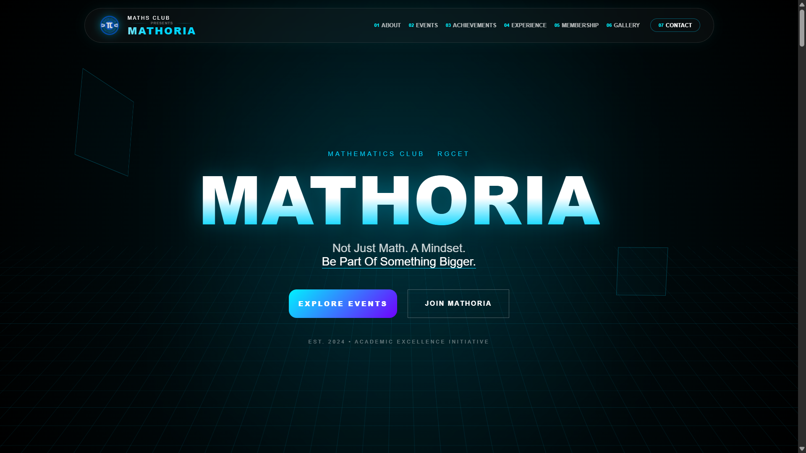

# 🧮 Mathoria
### Mathematics Club Digital Management & Student Engagement Platform

Mathoria is the official digital platform developed for the Mathematics Club of Rajiv Gandhi College of Engineering and Technology (RGCET), Puducherry.

The platform was designed to modernize club operations by providing a centralized system for membership registration, event management, communication, leadership information, achievement tracking, mathematical visualization, and student engagement.

The project serves as a digital ecosystem that strengthens the club's online presence while improving accessibility, participation, and management efficiency.

---

## 📸 Project Preview

<p align="center">
  
</p>

---

## 🎯 Project Objective

Traditional student clubs often rely on manual processes for:

- Membership registration
- Event announcements
- Student communication
- Documentation
- Achievement tracking

These processes can become inefficient as the club grows.

Mathoria was developed to provide a centralized digital platform that simplifies club management and improves student participation through technology.

---

## 🚀 Key Features

### 🏠 Homepage & Club Branding

The platform provides a modern landing page representing the Mathematics Club identity.

Features:

- Interactive homepage
- Club branding
- Navigation system
- Event highlights
- Membership access

---

### 👥 Membership Management Portal

An integrated membership registration system enables students to join the club digitally.

Features:

- Online registration
- Student information collection
- Department selection
- Academic year selection
- Membership generation support

Benefits:

- Eliminates manual registration
- Improves data management
- Simplifies onboarding

---

### 📅 Event Timeline & Event Management

The platform provides a dedicated event management section.

Features:

- Event schedules
- Event descriptions
- Registration links
- Timeline-based event display

Benefits:

- Better event planning
- Increased participation
- Improved communication

---

### 🏆 Achievement & Milestone Dashboard

A dedicated dashboard highlights club accomplishments and growth.

Features:

- Membership statistics
- Club achievements
- Participation records
- Growth milestones

Benefits:

- Motivates students
- Increases transparency
- Showcases club success

---

### 📚 Mathematical Visualization Lab

One of the unique features of the platform.

Features:

- Mathematical visualizations
- Dynamic animations
- Interactive theorem demonstrations
- Educational graphical content

Benefits:

- Makes mathematics engaging
- Supports visual learning
- Improves concept understanding

---

### 👨‍💼 Leadership Management

Displays organizational structure and leadership information.

Features:

- Faculty advisor details
- President information
- Office bearer profiles
- Role visibility

Benefits:

- Transparency
- Better communication
- Organizational clarity

---

### 🖼 Gallery & Documentation System

A centralized archive of club activities.

Features:

- Event photographs
- Activity records
- Memory archive
- Organized documentation

Benefits:

- Preserves club history
- Enhances engagement
- Improves visibility

---

### 📞 Contact & Communication Center

Students can communicate directly with club representatives.

Features:

- Contact form
- Official communication details
- Faculty coordinator information
- Social media integration

Benefits:

- Improved accessibility
- Better communication
- Faster support

---

## 🏗 System Architecture

```text
Students
    │
    ▼
Mathoria Platform
    │
    ├── Membership Portal
    ├── Event Management
    ├── Achievement Dashboard
    ├── Mathematical Visualization
    ├── Leadership Management
    ├── Gallery System
    └── Communication Center
    │
    ▼
Club Administration
```

---

## ⚙️ Technology Stack

### Frontend

- HTML5
- CSS3
- JavaScript

### Backend & Database

- Firebase

### UI/UX

- Responsive Design
- Interactive Animations
- Mobile-Friendly Interface

---

## 🌟 Unique Features

Unlike traditional club websites, Mathoria combines:

- Membership Automation
- Event Management
- Mathematical Visualization
- Achievement Tracking
- Leadership Management
- Digital Documentation
- Communication Management

within a single integrated platform.

---

## 📈 Impact

### Outcomes

- Strengthened the Mathematics Club's digital identity.
- Improved student engagement and participation.
- Simplified membership management.
- Centralized communication and documentation.
- Supported a growing community of 600+ members.

---

## 🔮 Future Enhancements

- Member Dashboard
- Attendance Tracking
- Digital Certificates
- Event Analytics
- QR-Based Membership Verification
- Mobile Application
- Admin Panel
- Automated Notifications

---

## 👨‍💻 Author

### Devakumar A

President – Mathoria Mathematics Club

B.Tech Computer Science and Engineering

Rajiv Gandhi College of Engineering and Technology (RGCET), Puducherry

### Contributions

- Website Architecture
- UI/UX Design
- Frontend Development
- Membership Portal Design
- Event Management System
- Mathematical Visualization Modules

---

## 📜 License

Developed for educational and organizational purposes.
